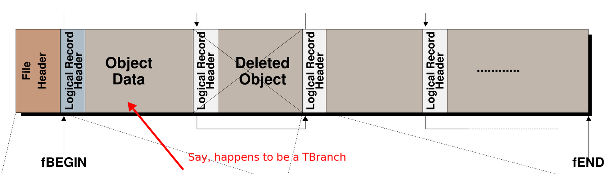
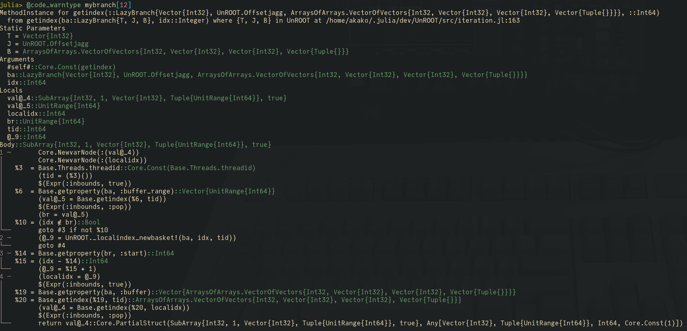

% HEP Infrastructure in Julia: `UnROOT.jl`
% Jerry Ling
% Sep. 27, 2021
# Technical tasks in HEP (analysis)
In the order of data-flow:

1. Read physics data from `.root` files. ([UnROOT.jl](https://github.com/tamasgal/UnROOT.jl))
2. Handle [custom classes](#sec:custom) and physics objects ([LVCyl.jl](https://github.com/JuliaHEP/LVCyl.jl))
3. Process the data, usually a reduction into histograms. ([FHist.jl](https://github.com/Moelf/FHist.jl))
4. Tinker with the script/program you wrote, usually for optimization or physics reason, repeat many times. ([Revise.jl](https://github.com/timholy/Revise.jl))
5. \* Run on accelerator computing resource. ([CUDA.jl](https://github.com/JuliaGPU/CUDA.jl))

(Then, add "fast" and "in parallel"(built-in ["green" threads](https://docs.julialang.org/en/v1/manual/multi-threading/)) to all of the above.)

This set of slides focus on the work done in the UnROOT.jl.
The main authors at this moment in time are:

- [Nick Amin](https://github.com/aminnj)[^1]
- [Tamas Gal](https://github.com/tamasgal) (creator)
- [Jerry Ling](https://github.com/Moelf)

[^1]: Thanks Nick for the visualizations.

# State of the UnROOT.jl
- Used in production at [KM3NeT](https://www.km3net.org/) + 2 LHC detector analysis
- Reading most used objects and data from root file:
    - TTree, TBranch, TDirectory, TNtuple, TH1/2D
    - Flat, Jagged, Doubly jagged
    - TLorentzVector and more custom structure
    - As a reference, we can read all branches of CMS's [NanoAOD](https://twiki.cern.ch/twiki/bin/view/CMSPublic/WorkBookNanoAOD).
- Unified user-level interface and it is [Fast](#sec:minibench).
- Less is more
    - Doesn't require 4 different chunking functions or 3 different ways of looping.
    - Users simply do everything they already knew, by treating the TTree as a table (they are
tables.), including Query-ing and multi-threading.

# 1000 Feet View of `.root`
\center 

The data almost always live inside a "branch", the purpose of most
of the logical metadata stuff: File Header, Streamer etc. are there
just so we can find the data's `TKey`, which tells us where and how data are stored inside the file.

# 100 Feet View of `TBranch`
The element type of a branch is fixed, meaning every event in a branch
has to have the same type. But they can be custom structure (e.g.
`TLorentzVector`) and/or "jagged". This information lives in the `TBranch` streamer object in a non-trivial way.

A branch is further divided into many "baskets". These baskets are
not arranged one next to another in the file. The `TBranch` objects contains the following:

* `fBasketSeek`: [248, 34865, 65932, 95550, 125071,...]

`fBasketSeek` tells us where (in terms of bytes offsets from the
beginning of the file) is each basket located, in this particular example 
first basket starts at 248th byte.

# LazyTree
When you bundle many branches together, you get a tree. Most of the time users are not randomly accessing indices, they **iterate** over the TTree. Baskets are usually small, O(KB) ~ O(MB)


The underlying baskets of different branches are not aligned in general. We simply cache the
last-used basket for each branch in RAM (a.k.a basket cache), such that new basket are read/decompressed as needed.


# Lazy to the Last Second
The interface is simple enough:
```julia
for evt in mytree
    if evt.nMuon != 4
        continue
    end
    # access more branches
end
```
`mytree` can have many many branches, and which branches need "access" can dynamically depend on the event content.
`LazyTree` is designed such that `evt` in the above example is still lazy, no data is read until `evt.nMuon` line.

The `evt` merely keeps track of which `TTree` it comes from and which event number it is, when `evt.nMuon` happens,
it effectively does `nMuonBranch[evt_idx]`.

# Composable Multi-Threading
To enable parallel access of a tree/branch, we only need to make sure the basket cache is thread-local and
everything else is already thread-friendly:
```julia
# from Polyester.jl
@batch for evt in mytree
    evt.nMuon < 4 && continue
    # more stuff
end
```

# Composable Multi-Threading
During parallel access, threads work on disjoint ranges, roughly speaking if we have 100 events and 4 threads, 
the 1st thread will work on `1:25`, the last thread will work on `76:100`, avoiding the race-condition in basket access.


# Custom Class Support {#sec:custom}
ROOT is immensely feature-rich, and users sometimes need to handle custom data structures when reading .root files.
UnROOT provides an (beta) interface allowing users to hook into the data parsing in [2 steps](https://tamasgal.github.io/UnROOT.jl/dev/advanced/custom_branch/).

Raw branch data is always available, so the only missing piece is an interpretation function:

1. Provide a `classname` mapping: `Dict("TLorentzVector" => LorentzVector{Float64})`
2. Specialize (extend) function: `UnROOT.interped_data(rawdata, rawoffsets, ::Type{LVF64}, ::Type{J})`
3. Profit.

Already being used in KM3NeT for real-time event reconstruction, high-level analysis and time calibration consistency checks.

# Conclusion and Future Work
- UnROOT.jl is ready for production around the "analysis" step 
    - "around", because could do analysis on lower level data, if needed.
    - fast and integrate seamlessly with Julia ecosystem for tabular processing and multi-threading.
- The ability to write to `.root` files has not been a priority so far:
    - usually not performance critical 
    - not many ecosystem advantages (e.g. no need for AutoDiff to know you're writing to disk)
    - already can do it via [PyCall.jl](https://github.com/JuliaPy/PyCall.jl) + uproot
- Low-hanging fruit:
    - Better `Tables.partitions`, helps writing. (github [issue](https://github.com/tamasgal/UnROOT.jl/issues/114))
    - Optimize slicing (github [issue](https://github.com/tamasgal/UnROOT.jl/issues/113))
- Plan to support `xrootd` via [Go-HEP/xrootd](https://hepsoftwarefoundation.org/gsoc/2018/proposal_GoHEPxrootd.html)
since Go compiles to `ccall()`-able libraries nicely.

# Backups: Mini Benchmarking {#sec:minibench}
To understand if we're doing anything "stupid" in our naive implementation, we
made [benchmarks](https://github.com/Moelf/UnROOT_RDataFrame_MiniBenchmark/tree/main/composite_benchmarks)
comparing the performance of `UnROOT` with solutions provided by ROOT:

|              | Time (s)    |
| ------------ | ----------- |
| PyROOT RDataFrame | 40.20  |
| Compiled for-loop (bind branch) | 28.15 |
| Compiled RDF | 19.82       |
| Julia (cold) | 20.58       |
| Julia (warm) | 19.80       |
| Compiled RDF (4-threads) | 5.64|
| Julia (4-threads) | 5.06   |

Table: "Compiled" means `g++ -O2`.

Conclusion: we're probably not doing something super bad. It doesn't really matter if Julia is slightly 
faster or slower than the fully compiled C++ code, the interactivity, flexibility, and being an expressive
high-level language should make it worthwhile.

# Getting hands on the data
Despite the overall complexity of `.root` file format, after the metadata extraction, dumping data from one event to the next
is relatively straightforward.

Here's a schematic of a single basket, the `TBasket` contains the information regarding compression algorithm etc. All of the
data we actually care about are inside `content` and `offsets` (in the case where data is jagged).
```
                                                 4 bytes           4 bytes
┌───────┬─────────┬──────────────────────────────┬─────┬────────────┬───┐
│ TKey  │ TBasket │ content                      │ len │ offsets    │ 0 │
└───────┴─────────┴──────────────────────────────┴─────┴────────────┴───┘
                  │←       fLast - fKeylen      →│                      │
                  │                                                     │
                  │←                      fObjlen                      →│
```
[Reference discussion](https://groups.google.com/g/polyglot-root-io/c/yeC0mAizQcA/m/gdPLyAH9AQAJ)

# Getting hands on the data {#sec:recipe}
Due to this design, the smallest unit of reading `.root` file is a basket -- you need to read and decompress one
basket even if you just want one event (because in general partial decompression is impossible, also 
offsets may be needed). Usually the size of basket is ~ few MB, so it's not an issue to 
keep the last-used one in RAM (basket cache).

Thus, the logical steps for reading data are:

1. Find which basket the event number belongs to by using `fBasketEntry`.
2. Parse `TBasket` to find out compression algorithm and raw bytes length
3. Read and decompress the raw bytes in this basket (raw bytes = `Vector{UInt8}`)
4. Reinterpret the bytes into data (according to the metadata) and offsets (for jagged branch)

# Building Block: LazyBranch
The tricky part is making the interpreted data available to user-level while maintaining the performance.
The starting point is:
```julia
julia> typeof(mybranch)
LazyBranch{Vector{Int32}, UnROOT.Offsetjagg, ...

julia> mybranch[54]
3-element view(::Vector{Int32}, 229:231) with eltype Int32:
 50
 51
 52
```
This would use the machinery described in the [previous slide](#sec:recipe).
Despite Julia's native support of jagged array (very fast even), to reduce memory allocation, we use
[ArraysOfArrays.jl](https://github.com/JuliaArrays/ArraysOfArrays.jl) for jagged branch.
In this case, the 54th event's data is at `229:231` of the basket, and we non-copy `view`ed it.

# Building Tree from Branches
The branches of a tree are totally independent, so it's not conceptually challenging to just "bundle them together"
and make a `Tree`. 

Due to the larger-than-RAM nature, you might think we're about to reinvent `Dask`-like
lazy dataframe.

Fortunately, we don't need to. In fact the $\julia$ counterpart of `pandas`, 
[DataFrames.jl](https://github.com/JuliaData/DataFrames.jl) already supports 
lazy column. More precisely, it "doesn't care" what your columns are as long as they have defined length
and indexing interface.

But we use [TypedTables.jl](https://github.com/JuliaData/TypedTables.jl) (which supports lazy column
for the same reason) instead due to one important factor: performance.

# Type Stability of LazyBranch and LazyTree
$\julia$ includes powerful [inspection tools](https://docs.julialang.org/en/v1/manual/performance-tips/#man-code-warntype)
you can look at LLVM or assembly. We just want `@code_warntype` and see for ourselves that there's no 
boxing or instability:

\center{height=250px}

# Type Stability
Two kinds of type stability:

1. Can the return type be inferred from just the **types** of the inputs?
2. Can the types of all variables in the function bodied be inferred?

The second point manifests in any user function, consider an analysis function contains the following:
```julia
for evt in mytree
    compute(evt.Muon_pt)
    # more stuff
end
```

# Type Stability
```julia
for evt in mytree
    compute(evt.Muon_pt)
    # more stuff
end
```
If the type of `evt.Muon_pt` is unclear to compiler, then $\julia$ has no choice but to dynamically
dispatch (call) the function `compute()`, which results a slow down.

Type instability can also cause slow down via what's called "boxing/unboxing" which is essentially
handling variable of unknown type in a "box" until used, this causes allocation $\Rightarrow$ slow down.

This leads us to `TypedTable.jl`, which is a thin wrapper around the built-in `NamedTuple`. It
retains the type stability of accessing each branch when we put branches together into a tree.
